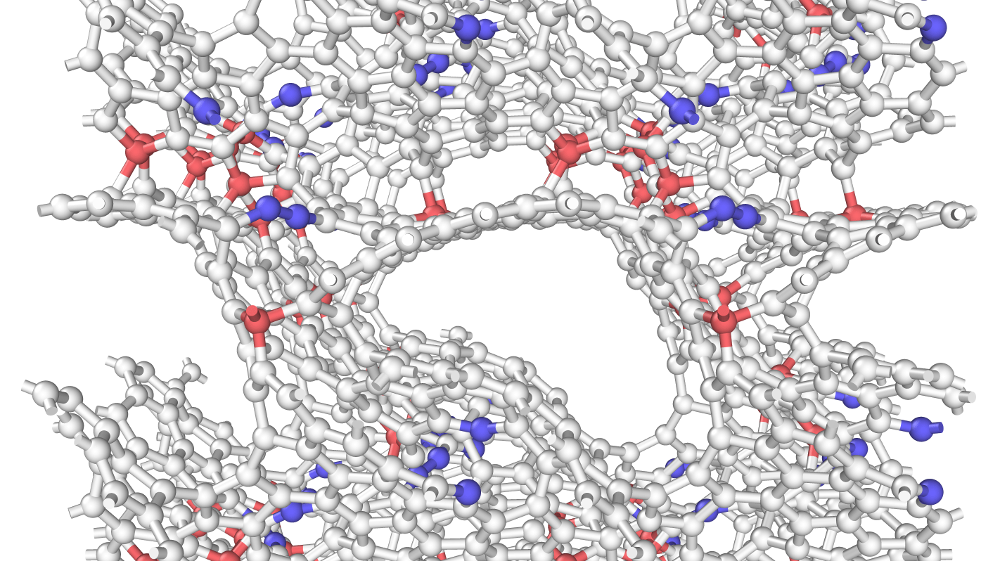
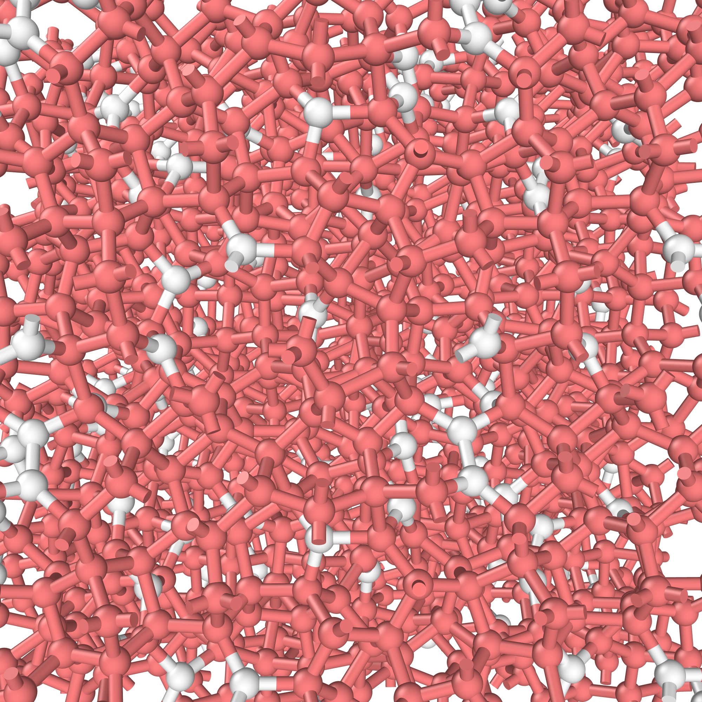
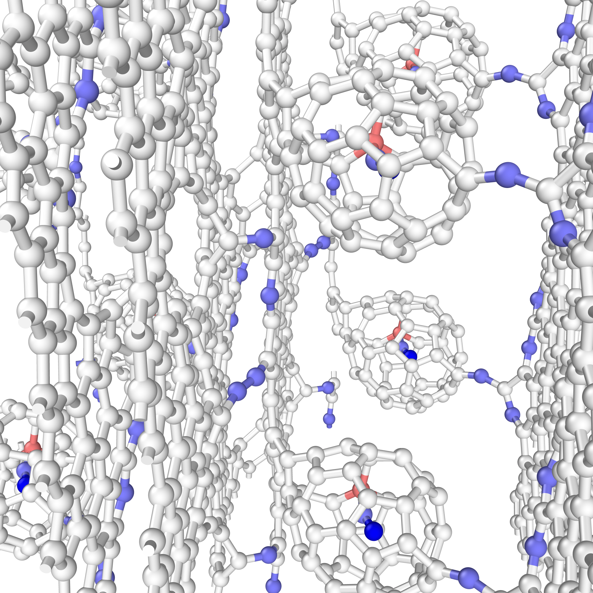
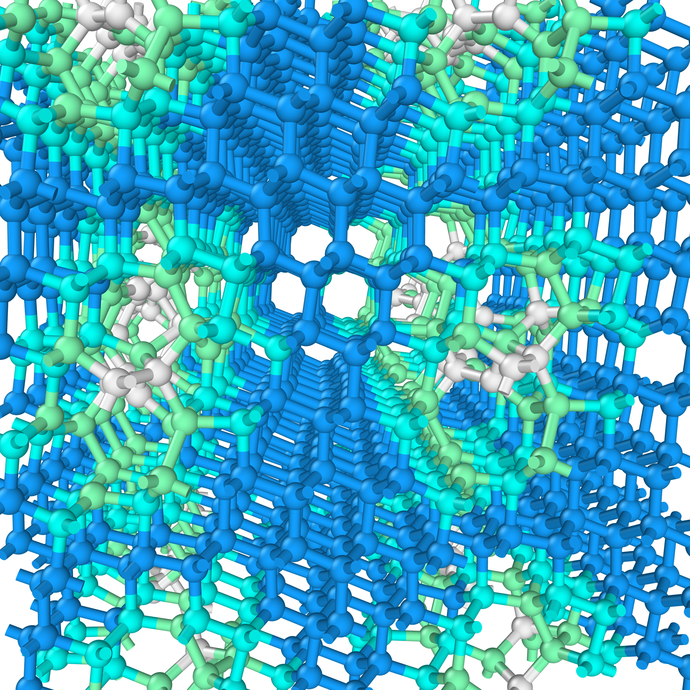
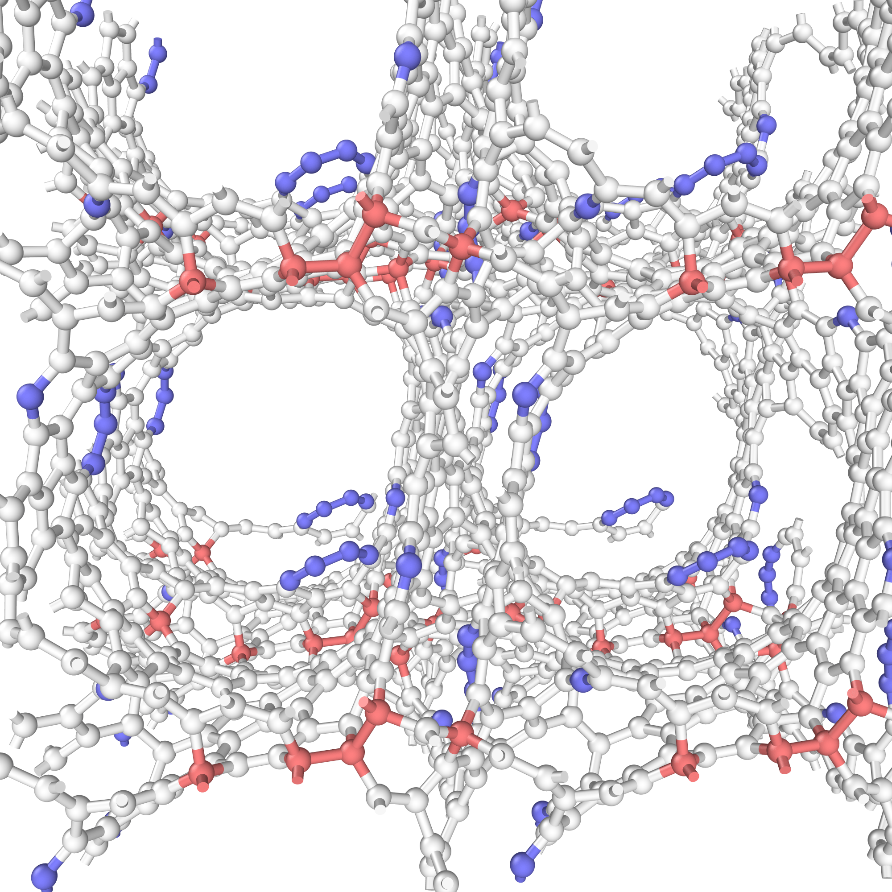
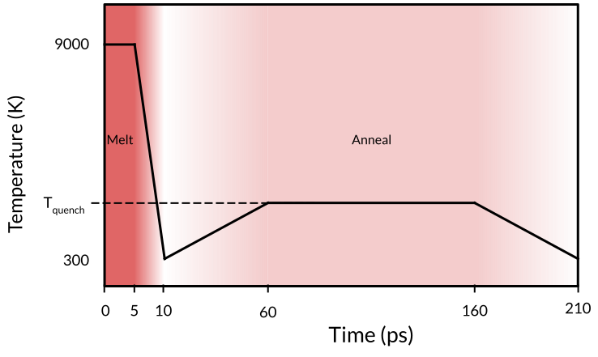

# 22.9 Million Carbon Atom Dataset

See the [paper](TODO: INSERT) for more details.

## The Data

<p align="center">
    
    
    
    
    
</p>

[The dataset](results/) contains 546 uncorrelated carbon trajectories at a variety of densities (ranging from 1.0 gcm-3 to 3.5 gcm-3) and temperatures.

As can be seen from the examples above (generated using [Ovito](https://www.ovito.org)), this dataset captures a wide variety of chemical environments and features, including carbon nano-tubes, graphitic films, buckyball-esque clusters, cubic and hexagonal diamond and tetrahedral amorphous carbon.

The density, anneal temperature, trajectory id and timestamp for each structure is given in the header of each extxyz file entry. This can be accessed using, for instance, the [ase](https://wiki.fysik.dtu.dk/ase/) python package:

```python
from ase.io import read


trajectory = read("results/density-1.0-T-2000.extxyz", index=":")
structure = trajectory[0]

density = structure.info["density"]          # in gcm-3
temperature = structure.info["temperature"]  # in K
trajectory_id = structure.info["run_id"]     # integer
timestamp = structure.info["time"]           # in ps
```


## Generation Procedure

<p align="center">
    
</p>

Each trajecotry was seeded using a structure generated using the [`./generate_structure.py`](./generate_structure.py) script, which generates random structures for a given density using a hard-sphere constraint.

The [LAMMPS](https://lammps.sandia.gov/) molecular dynamics package, together with the [C-GAP-17 potential](https://journals.aps.org/prb/abstract/10.1103/PhysRevB.95.094203) was then used to perform a melt-quench-anneal simulation, with temperature profile as depicted above. Snapshots were taken at 1ps intervals, for a total of 210 snapshots per trajectory.
(546 trajectories * 210 snapshots * 200 atoms = 22.9 million atomic enviroments).

## Citation

If you use this dataset in your research, please cite the following paper:

```bibtex
@article{TODO: INSERT}
```